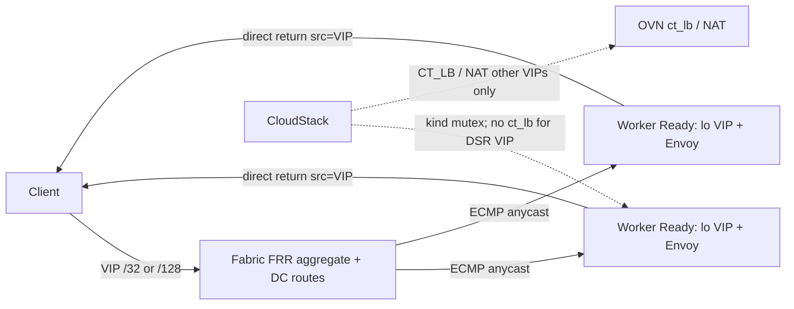

# Design: DSR software LB vs CT_LB — implementation contract

> **Status:** ACCEPTED architecture — **CloudStack implementation in progress (disabled-by-default)**.  
> **Date:** 2026-07-17  
> **Parent ADR (cross-repo SoT):**  
> `~/dev/infra-base/docs/architecture/0001-dual-stack-active-active-dsr-software-lb.md`  
> **Gap audits:**  
> `docs/audits/2026-07-17-dsr-software-lb-parity-and-ct-separation.md`  
> `~/dev/infra-base/docs/audits/2026-07-17-k8s-istio-dsr-backend-assessment.md`  
> **Scope:** LAX only. Deploy path when implementing: **jar-direct** (no `.deb` unless asked).  
> **Feature gate:** disabled-by-default until acceptance suite green.

This document is the **CloudStack-owned implementation contract**. It must not
contradict the parent ADR. Prefer editing this file + the parent ADR over
scattering parallel design notes.

---

## 1. Decision summary (locked)

| Lock | Rule |
|---|---|
| Planes | `CT_LB` (default, OVN `ct_lb`) vs `DSR_SOFTWARE` (opt-in, software DSR) |
| Parity | Full IPv4 `/32` + IPv6 `/128` for every DSR VIP role |
| Selection | No conntrack for DSR backend pick |
| CT allowed | Only separate NAT: SourceNat, StaticNat; PF stays CT machinery until redesigned |
| Software-only | No HW-offload dependency for DSR correctness |
| Mutex | Hard reject incompatible combos (X1–X12) |
| Default | Existing rules remain `CT_LB`; DSR create requires feature gate + offering capability |

**DSR is not** OVN `Load_Balancer` + `skip_snat`. Northd still compiles LB to
`ct_lb()` — that remains Kind A.

---

## 2. Packet flow (C4 / sequence)

```
Client
  │  dst = VIP (v4 /32 or v6 /128)
  ▼
Fabric / ECMP anycast  ──────────────►  healthy CKS worker
  │                                       lo owns VIP
  │                                       hostNetwork Envoy
  │                                       reply src = VIP  ──► Client
  │
  └── MUST NOT: OVN ct_lb reverse, hairpin SNAT, force SNAT,
                single chassis-redirect (e.g. norbert/aragog CR-LRP) pin
```

Mermaid (container-level):



---

## 3. Schema / API / domain

| Layer | Change | Notes |
|---|---|---|
| DB | `load_balancing_rules.lb_kind` VARCHAR/ENUM default `CT_LB` | Upgrade SQL + VO |
| API | `lbkind` on create/list (`ct_lb` \| `dsr_software`) | Wire names stable en-US lower |
| Domain | `LbKind { CT_LB, DSR_SOFTWARE }` | Not inferred from algorithm/scheme |
| Offering | capability `SupportedLbKinds` | Missing kind → reject create |
| Map kind | `Kind.DSR_LB` (or host-side map) for DSR ownership | Distinct from `LOAD_BALANCER` |
| external_ids | `cs_lb_kind=CT_LB\|DSR_SOFTWARE` | Reconciler filter |
| Feature gate | ConfigKey default **false** (name at implement) | DSR create fails closed when off |

**Do not** encode DSR as algorithm, scheme, protocol, or free-form network detail alone.

### Dispatch

```
create/apply LB rule
    │
    ├─ gate off or kind missing → reject DSR
    ├─ lb_kind = CT_LB  → OvnLoadBalancerService
    │                      createLoadBalancer, hairpin, force SNAT (as today)
    └─ lb_kind = DSR_SOFTWARE → DsrSoftwareLbService
                               never nb.createLoadBalancer / NAT / hairpin / force SNAT
                               1) program VPC LR Logical_Router_Static_Route ECMP
                                  VIP/32 + VIP/128 → Ready guest backends
                                  external_ids: cs-dsr-route=<ruleId>, cs_lb_kind=DSR_SOFTWARE
                               2) withdraw CT_LB host BGP (dual-stack atomic)
                               guest Calico anycast remains the fabric attractor
```

`OvnLoadBalancerService.validateLBRule` / apply **must assert kind == CT_LB**
before any NB LB write. OVN element returns false for DSR (no half-apply).

---

## 4. Hard mutex (API + apply + reconciler)

| # | Reject |
|---|---|
| X1 | DSR + OVN LB/ct_lb same VIP:port |
| X2 | DSR + hairpin / force SNAT for VIP |
| X3 | DSR + HW-offload-only LB datapath offering |
| X4 | DSR + StaticNat same public VIP |
| X5 | DSR + PortForward same VIP:port |
| X6 | DSR + CT stickiness |
| X7 | DSR + leastconn |
| X8 | Mixed kinds dual-stack |
| X9 | DSR without backend VIP acceptance readiness |
| X10 | In-place kind flip without migrate tear-down |
| X11 | Overlapping ports different kinds same VIP |
| X12 | DSR VIP == VPC source-NAT IP |

**Error message contract (examples, en-US, stable):**

- `Load balancer kind DSR_SOFTWARE is incompatible with OVN conntrack LB (ct_lb) on VIP <addr> port <p>`
- `Load balancer kind DSR_SOFTWARE cannot share VIP <addr> with StaticNat or PortForward`
- `Load balancer kind DSR_SOFTWARE requires software datapath; network offering enables hardware offload LB`
- `IPv4 and IPv6 load balancer kinds must match for dual-stack rule id=<id>`
- `Load balancer kind DSR_SOFTWARE is disabled by feature gate`

---

## 5. Conntrack boundary

| Allowed CT | Service | OVN |
|---|---|---|
| Source NAT | `OvnSourceNatService` | `NAT` snat |
| Static NAT / FIP | `OvnStaticNatService` | `NAT` dnat_and_snat |
| ACL related | `OvnFirewallService` | allow-related |
| PortForward (today) | `OvnPortForwardingService` | Load_Balancer/ct_lb — **not DSR**; VIP mutex only |

| Forbidden for DSR | Why |
|---|---|
| `ct_lb` / `ct_lb_mark` | Selection + reverse |
| `hairpin_snat_ip` | SNAT |
| `lb_force_snat_ip` | SNAT |
| `affinity_timeout` / selection_fields CT affinity | CT stickiness |
| HW offload of above for DSR path | Software kind |

Finding 10 (`lb_force_snat_ip=router_ip` east-west issues) stays Kind A only —
DSR must not depend on it.

---

## 6. IPv4 / IPv6 parity gaps (must fix for DSR claim)

From audit (still OPEN until closed in code):

| Gap | Fix requirement |
|---|---|
| G1 | Backend NIC resolution for v6 (not only `findByIp4AddressAndNetworkId`) |
| G2 | Health-check source for v6 CIDR |
| G3 | Do **not** short-circuit `validateLbRule` for public IPv6 |
| G4 | Unified apply path / single kind mutator per dual-stack rule |
| G5 | BGP announce **both** `/32` and `/128` or neither for DSR role |

---

## 7. BGP / chassis-redirect interaction

| Plane | CS behavior |
|---|---|
| CT_LB VIP | Existing `announce` / `announceHost6` on gateway chassis OK |
| DSR VIP cutover | **Withdraw** CT_LB host announce + delete OVN LB row; guest Calico becomes attractor |
| Private ECMP | `ovn.lr.ecmp.static.routes` / auto ECMP remains for private VIP N-S; orthogonal to public DSR cut |
| Chassis-redirect | DSR VIP traffic must not require CR-LRP locality (norbert/aragog pin) |

Provider fabric remains **aggregate-only by default** (config-mgmt ADR 0003).

---

## 8. Migration / rollback (CS side)

1. Ship code with gate **off**; default kind CT_LB.  
2. Enable gate on canary zone/account.  
3. Create DSR rule **or** migrate: delete CT_LB rule → create DSR (X10: no silent in-place flip).  
4. Ensure guest lo+BGP ready before withdrawing CT backends (coordinate CKS).  
5. Rollback: recreate CT_LB rule; withdraw guest advertise; restore backends.

**Mid-flow:** node loss → RST for flows pinned to that anycast member; no CT state migrate.
Document in API/admin notes.

---

## 9. Work packages (implementation order)

| # | Package | Acceptance |
|---|---|---|
| 1 | Schema + API `lb_kind` + upgrade | list/create show kind; default CT_LB |
| 2 | Feature gate ConfigKey | DSR create fails when false |
| 3 | Manager mutex X1–X12 v4+v6 | unit + integration reject matrix |
| 4 | OVN path assert CT_LB only | no NB LB for DSR |
| 5 | DsrSoftwareLbService skeleton | no ct_lb; VIP ownership probes |
| 6 | Parity G1–G5 | dual-stack create/validate |
| 7 | BGP withdraw on DSR apply / re-announce on rollback | vtysh evidence |
| 8 | Reconciler kind filters | no heal DSR → Load_Balancer |
| 9 | Tests | unit X1–X12; Marvin dual-stack; N3 conntrack flush scenario documented |
| 10 | Docs | this file progress table; parent ADR unchanged unless supersede |

---

## 10. Code anchors

```
plugins/network-elements/ovn/.../element/OvnLoadBalancerService.java
plugins/network-elements/ovn/.../client/OvnNbClient.java
  createLoadBalancer, ensureLbForceSnat, attachLoadBalancerToLogicalRouter
plugins/network-elements/ovn/.../element/OvnPortForwardingService.java
plugins/network-elements/ovn/.../element/OvnStaticNatService.java
plugins/network-elements/ovn/.../element/OvnSourceNatService.java
plugins/network-elements/ovn/.../manager/OvnBgpRedistributeManager.java
server/.../lb/LoadBalancingRulesManagerImpl.java
engine/schema/.../dao/LoadBalancerVO.java
```

---

## 11. Progress

| Item | Status |
|---|---|
| Parent ADR accepted | ✅ 2026-07-17 |
| This design contract | ✅ written |
| Schema / API / code | ✅ 4.24.1.32: `lb_kind`, feature gate, mutex, DsrSoftwareLbService, OVN CT_LB assert, tests (gate default **false**) |
| OVN LR DSR routes | ✅ VIP `/32`+`/128` ECMP `Logical_Router_Static_Route` (`cs-dsr-route`) on VPC LR; no LB/NAT; dual-stack atomic; reconciler re-converge |
| Feature gate live | ❌ default off (`network.lb.dsr.software.enabled=false`) — do not enable in production until acceptance green |
| Istio public cutover | ❌ (CKS + CS coordinated) |

### Packet path (data node → guest) — normative

```
Client → fabric / data FRR (guest BGP /32+/128 OR recursive via VPC GW .32/::32)
       → pub-anchor (kernel FIB may recurse via .32/::32 — transport to OVN, not L2 direct)
       → OVN public LS → VPC LR
       → DSR Logical_Router_Static_Route ECMP: VIP/32|/128 → guest NIC IPs
       → guest tier LS → Envoy hostNetwork (lo owns VIP)
       → direct return src=VIP (no ct_lb reverse, no CR-LRP pin)
```

**PASS criteria (verifier):** BGP guest RIB has paths + OVN LR has DSR-owned VIP→guest routes + direct-return works.
**Not required:** kernel FIB next-hop L2-adjacent to guest (recursive via `.32`/`::32` is normal).

---

## 12. Non-goals

- Implementing IPVS-DR in this first code train (secondary per parent ADR).  
- Changing default of existing LB rules.  
- Removing CT from NAT/FIP.  
- NYC scope.  
- Editing production OVN outside API/`cmk`.
